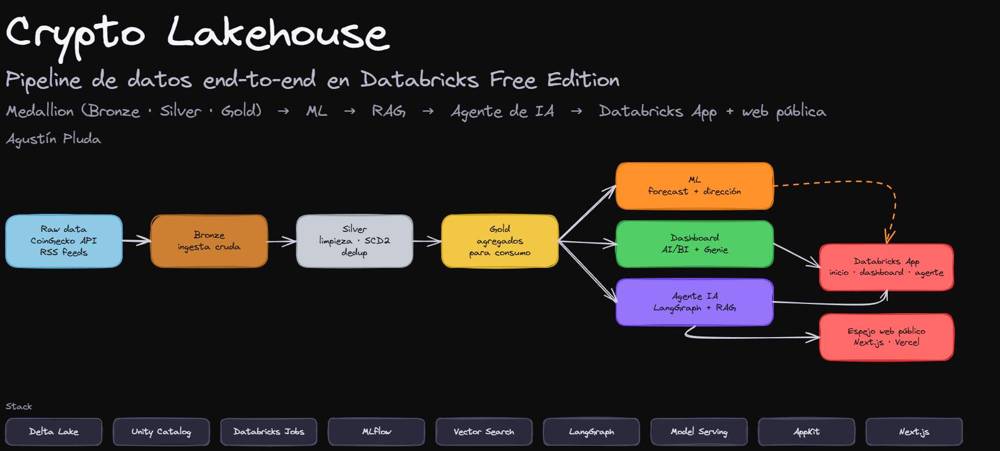
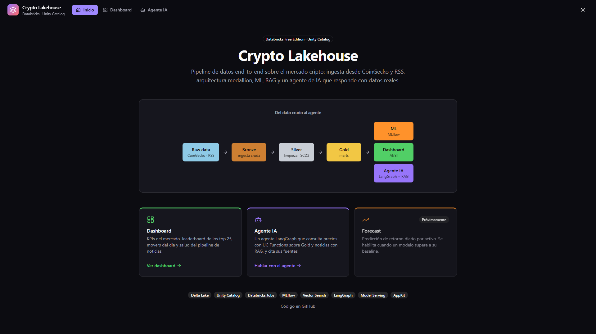
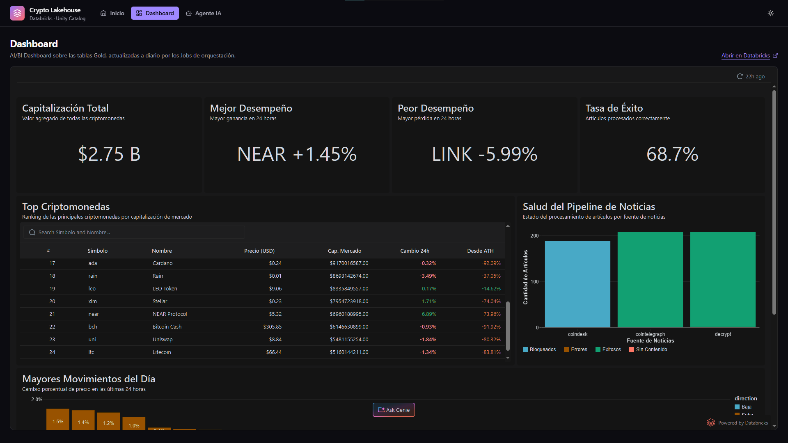
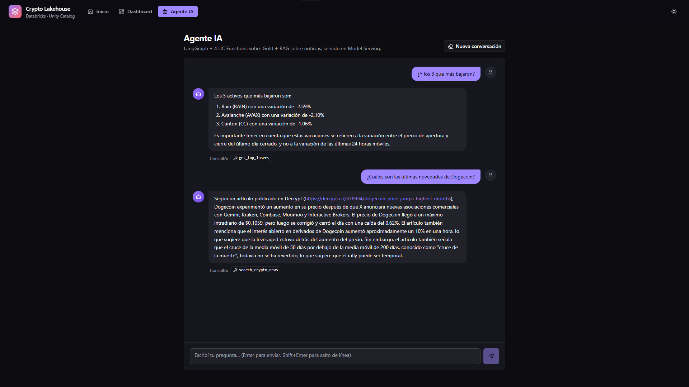
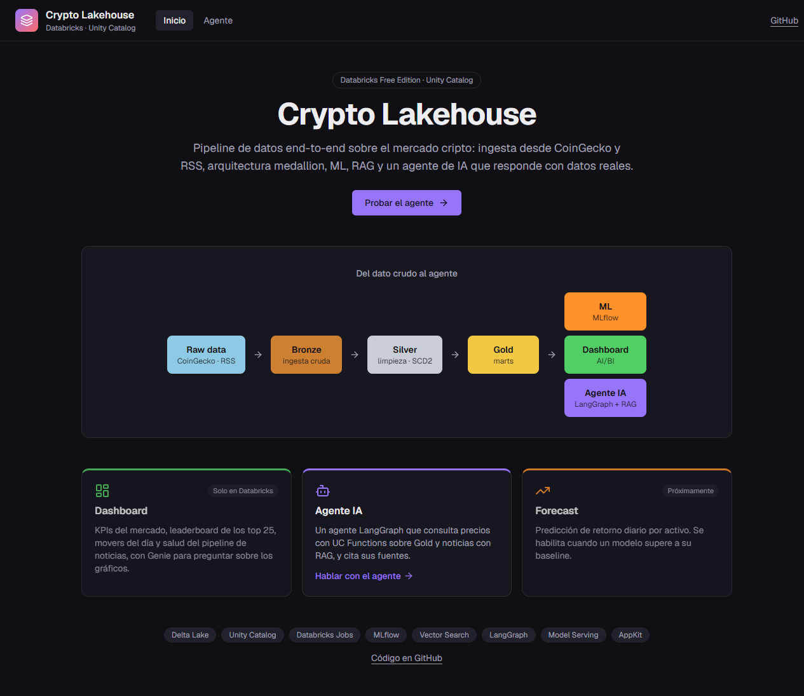
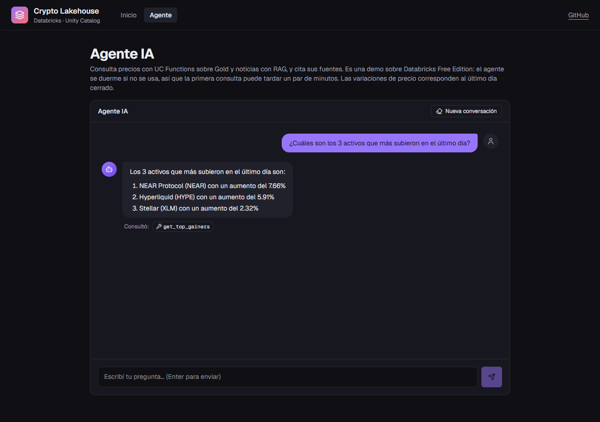
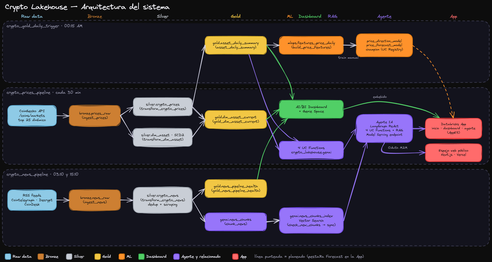
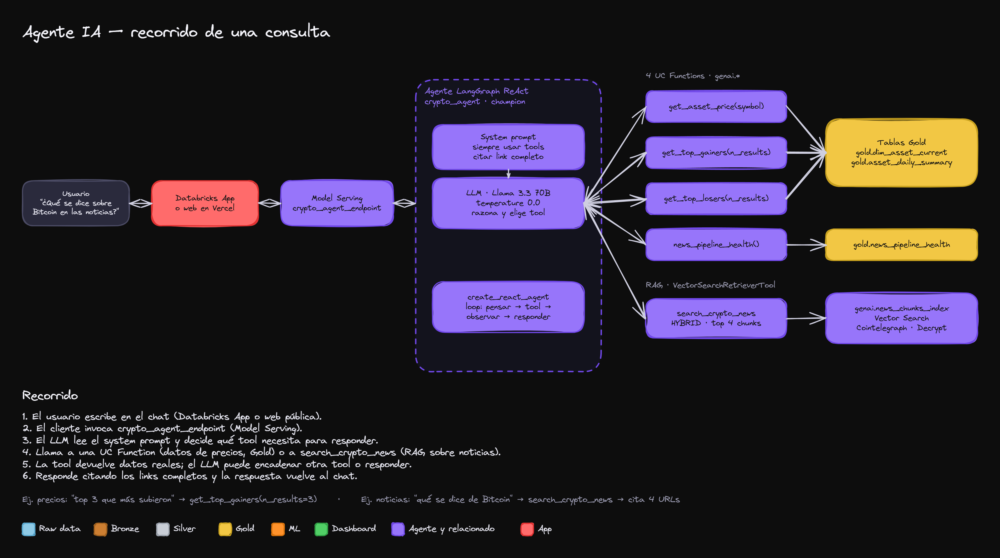
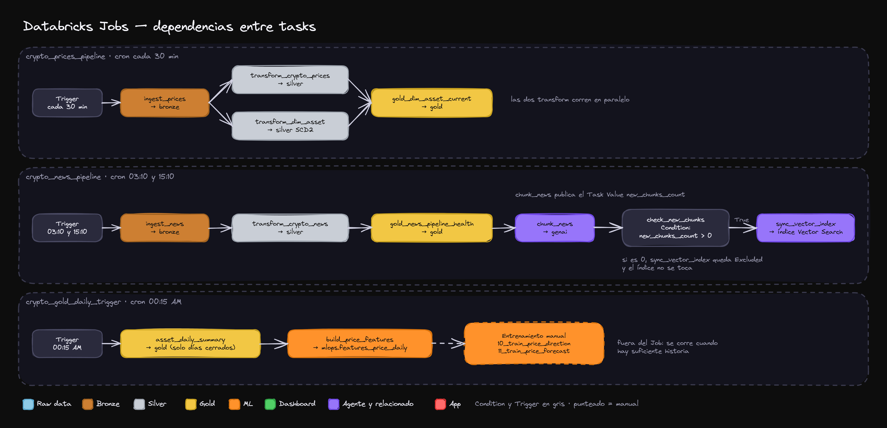

# Crypto Lakehouse


**Pipeline de datos de punta a punta sobre el mercado cripto, construido en Databricks Free Edition:**
ingesta recurrente desde APIs reales, arquitectura medallion, ML con MLflow, RAG y un agente de IA que
responde con datos reales y cita sus fuentes. Todo gobernado dentro de un único Unity Catalog.

### 👉 [Probar el agente en vivo](https://crypto-lakehouse-databricks.vercel.app/)

> La demo corre sobre el plan gratuito de Databricks: si el agente estuvo inactivo, la primera consulta
> puede tardar un par de minutos en despertar.



## Qué es

El objetivo fue ejercitar la mayor superficie posible de la plataforma, no armar un pipeline chico:

- **Ingesta** cada 30 minutos de precios (CoinGecko, top 25 dinámico) y 2 veces por día de noticias (RSS).
- **Medallion** Bronze → Silver → Gold con PySpark y Delta Lake, incluyendo una dimensión **SCD Type 2**.
- **Tres consumidores** sobre el mismo Gold: un **dashboard AI/BI** con Genie, un **pipeline de ML** con
  MLflow y un **agente de IA** (tools SQL + RAG sobre Vector Search).
- **Dos frontends**: una **Databricks App** (inicio, dashboard embebido y agente) y un **espejo público**
  en Next.js desplegado en Vercel.
- **Orquestación** con 3 Jobs de Databricks Workflows, dependencias entre tasks y lineage verificado de
  punta a punta.

## Capturas

### Databricks App

Inicio, dashboard AI/BI embebido (con Genie para preguntar sobre los gráficos) y el agente, con las
herramientas que consultó en cada respuesta.







### Espejo público (Next.js · Vercel)





## Arquitectura



Todo el lineage, de la tabla Bronze al agente servido, vive en un único catalog (`crypto_lakehouse`) con
cinco schemas separados para poder mostrar permisos distintos por capa:

| schema | contenido |
|---|---|
| `bronze` | payloads crudos de CoinGecko y RSS con metadata de ingesta |
| `silver` | hechos tipados, `dim_asset` (SCD2), noticias limpias y scrapeadas |
| `gold` | marts agregados para el dashboard, el agente y las features |
| `mlops` | feature table y modelos registrados en el Model Registry de UC |
| `genai` | chunks de noticias, índice de Vector Search, UC Functions y el agente registrado |

## El agente

Un agente **LangGraph ReAct** (Llama 3.3 70B) con cinco herramientas: cuatro **UC Functions** que
consultan Gold (precio de un activo, mayores subas, mayores bajas, salud del scraping) y una de **RAG**
sobre las noticias. Está registrado en Unity Catalog con el alias `champion` y servido en un endpoint de
Model Serving. Responde citando los links completos de las noticias que usó.



## Orquestación

Tres Jobs con tasks encadenadas, horarios escalonados y un **sync condicional** del índice de Vector
Search: si no hay noticias nuevas, ese task se excluye y el índice no se toca.



## Decisiones técnicas que vale la pena destacar

- **Guard contra el baseline en el ML.** El alias `champion` solo se asigna si el modelo supera a un
  baseline trivial. En la primera corrida real (8 días de historia) ninguno lo superó, y el guard
  funcionó como se diseñó: no se promovió nada. Detalle y métricas en [`notebooks/05_ml`](notebooks/05_ml/README.md).
- **SCD2 manual en lugar de Lakeflow declarativo.** Se implementó `dim_asset` con `MERGE INTO` y se
  probó también `AUTO CDC FROM SNAPSHOT`; se descartó porque era redundante y chocaba con el cupo de
  compute serverless. El razonamiento está en [`notebooks/02_silver`](notebooks/02_silver/README.md).
- **El deploy del agente llevó 11 versiones.** Cinco causas de fallo distintas, desde cupo de compute
  hasta conflictos reales de dependencias entre `langchain`, `langgraph` y `openai-agents`. Está
  documentado en [`notebooks/07_agent`](notebooks/07_agent/README.md).
- **Calidad de datos en Gold.** Rankings calculados solo sobre el último día cerrado, y una dimensión
  SCD2 resuelta con `ROW_NUMBER` para no generar símbolos nulos.
- **Mínimo privilegio en la demo pública.** La web de Vercel usa OAuth M2M con un Service Principal que
  solo puede consultar el endpoint del agente, sin acceso a tablas. El servidor transmite la respuesta
  con *keepalive* para tolerar los arranques en frío y aplica rate limiting.
- **Una lección sobre Unity Catalog.** Recrear una UC Function con `CREATE OR REPLACE` invalida las
  credenciales que el endpoint resolvió al desplegar; hay que redeployar el endpoint.

## Estado y limitaciones

- ✅ Ingesta, medallion, dashboard, RAG, agente, orquestación y las dos aplicaciones, funcionando.
- ⚠️ **Los modelos de ML todavía no superan a su baseline** con la historia disponible, así que no hay
  `champion` ni predicciones en la App. Se retoma con más datos, features estacionarias y validación
  walk-forward.
- ⚠️ **Free Edition**: el endpoint se duerme por inactividad, el compute serverless tiene cupo diario y el
  rate limiting de la demo es en memoria.
- Los datos son de mercado en tiempo casi real, pero el proyecto es una demostración técnica: no es
  asesoramiento financiero.

## Stack

Databricks (Free Edition) · Delta Lake · Unity Catalog · PySpark · Databricks Workflows · MLflow ·
Vector Search · Model Serving · LangChain / LangGraph · AI/BI Dashboards y Genie · Databricks Apps
(AppKit, React) · Next.js · Vercel · Python · SQL · TypeScript.

## Estructura del repositorio

```
notebooks/
  00_setup/          catalog y schemas
  01_bronze/         ingesta de precios y noticias
  02_silver/         limpieza, SCD2 y scraping
  03_gold/           marts agregados
  05_ml/             features y entrenamiento
  06_rag/            chunking, índice y chain de RAG
  07_agent/          UC Functions y agente
  08_orchestration/  Jobs y dependencias
app/                 Databricks App (AppKit): inicio, dashboard embebido y agente
web/                 espejo público en Next.js para Vercel
dashboards/          export del AI/BI Dashboard y notas del Genie Space
docs/
  diagrams/          diagramas de Excalidraw (fuente .excalidraw, imagen .png y scripts)
  DEVELOPMENT_LOG.md bitácora de cómo se construyó el proyecto
```

Cada carpeta de `notebooks/` tiene su propio README con las decisiones de esa fase.

## Cómo reproducirlo

1. Crear un workspace de [Databricks Free Edition](https://www.databricks.com/learn/free-edition) y
   sincronizar este repo.
2. Ejecutar los notebooks en orden numérico (`00` a `14`); cada fase documenta sus dependencias.
3. Crear los 3 Jobs siguiendo [`notebooks/08_orchestration`](notebooks/08_orchestration/README.md)
   (tasks con *Source: Workspace*).
4. Desplegar la App de [`app/`](app/README.md) con la CLI de Databricks.
5. Para el espejo público, configurar las variables de [`web/.env.example`](web/.env.example) y desplegar
   `web/` en Vercel.

## Trabajo futuro

- **Forecast:** retomar los modelos con más historia y servir el `champion` en el último endpoint
  disponible; sumar una pestaña de Forecast a la App.
- **Datos reales en el Home público:** un task del Job diario que genere un `kpis.json` (KPIs, movers,
  leaderboard, salud del scraping y sparklines) y lo entregue a la web, sin darle permisos nuevos al
  Service Principal.
- **Rate limiting compartido** (por ejemplo Upstash) para la demo pública.

## Autor

**Agustín Pluda** · [GitHub](https://github.com/AgusPluda)

Proyecto de portfolio con el que cierro el learning path oficial de Databricks Academy.
